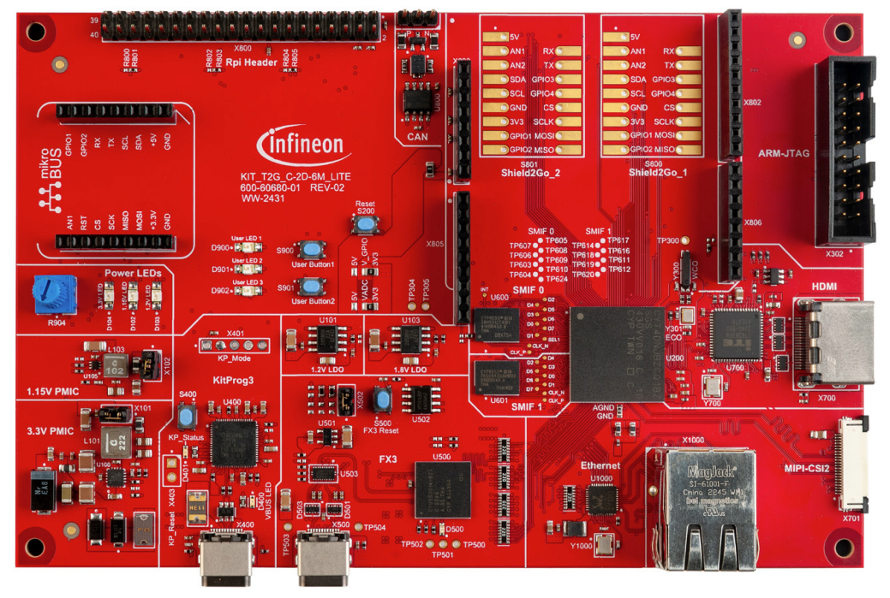
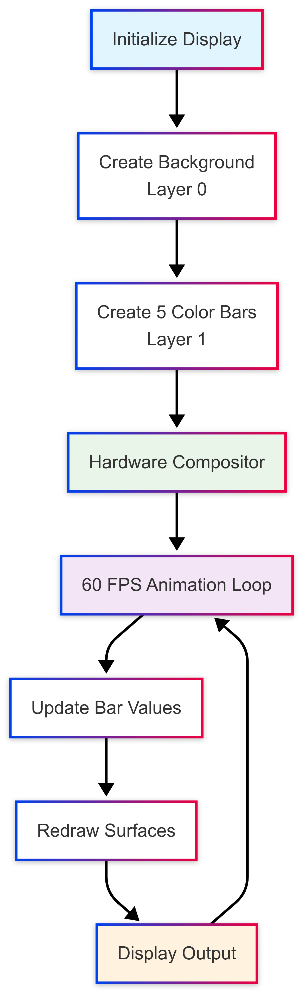
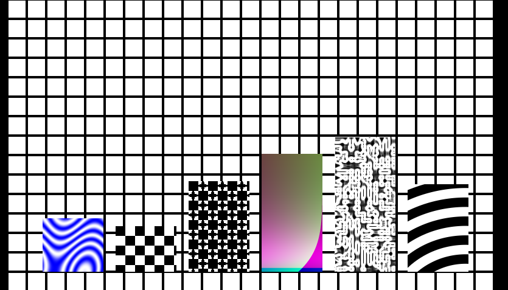

# Graphics Window Example

**This code example demonstrates the fundamental display engine concepts in the Infineon GFX driver through animated bars visualization showing multi-layer composition, surface management, and real-time graphics updates.**

The drivers used or available in this code example are listed below.
- [Graphics Driver for TRAVEO™ T2G cluster series user guide](https://myicp.infineon.com/sites/TRAVEODocumentation/Lists/defaultdoclib/Forms/AllItems.aspx?RootFolder=%2Fsites%2FTRAVEODocumentation%2FLists%2Fdefaultdoclib%2FTraveo%20II%2FTraveo%20II%20Cluster%2FGraphics&FolderCTID=0x01200023F2B2CA20D58647B6BFDE768454209B&View=%7BC8DBE6BD%2D4E7B%2D49A9%2D9267%2D2F926C13CB27%7D)
  - Chapter 4: Modules
  - Chapter 5: Classes
> **Note:** The above document are available on the myInfineon Collaboration Platform (MyICP). If not already available, please create a myInfineon account on [www.infineon.com](http://www.infineon.com/). Then, contact traveo@infineon.com and request access to TRAVEO™ T2G myICP.


- [JPEG decode driver user guide (TRAVEO™ T2G cluster series)](https://www.infineon.com/assets/row/public/documents/10/44/infineon-traveo-t2g-jpeg-decode-user-guide-usermanual-en.pdf?fileId=8ac78c8c8c3de074018c816028cf0ca8)
  - Chapter 2: JPEG decode driver

## Device

The device used in this code example (CE) is:
- [TRAVEO™ T2G CYT4DN Series](https://www.infineon.com/products/microcontroller/32-bit-traveo-t2g-arm-cortex/for-cluster/t2g-cyt4dn)

## Board

The board used for testing is:
- TRAVEO™ T2G Cluster 6M Lite Kit ([KIT_T2G_C-2D-6M_LITE](https://www.infineon.com/cms/en/product/evaluation-boards/kit_t2g_c-2d-6m_lite/))



## Scope of work

This example demonstrates the fundamental display engine concepts through an animated bars visualization. The user will learn about layer composition, surface creation and management, real-time graphics updates, and visual effect generation. This serves as an excellent introduction to the graphics capabilities before moving to more complex applications like games or user interfaces.

### Primary Objectives:
- **Display Engine Fundamentals**: Demonstrate core display initialization and configuration
- **Multi-Layer Composition**: Show how to create and manage multiple display layers
- **Dynamic Content**: Implement real-time animation with smooth visual updates
- **Surface Management**: Learn surface creation, pixel manipulation, and memory management
- **Visual Effects**: Create appealing graphics with colors, gradients, and transparency

### Learning Outcomes:
- Understand the graphics display pipeline and layer system
- Master surface creation and pixel-level manipulation
- Learn to implement smooth real-time animations
- Apply knowledge to create visually appealing graphics demonstrations

### Features Demonstrated:
- **Animated Color Bars**: Five colored bars (Red, Green, Blue, Yellow, Cyan) that animate from 0-100%
- **Random Animation**: Bars randomly change target values creating organic movement patterns
- **Multi-Layer Rendering**: Background grid pattern on Layer 0, animated bars on Layer 1
- **Real-Time Updates**: Smooth 60 FPS animation with dynamic surface content updates
- **Visual Design**: Professional appearance with borders, transparency, and grid background
- **Status Monitoring**: Console output showing current bar values and animation progress

## Introduction

TRAVEO™ T2G devices provide advanced 2D graphics acceleration capabilities through a sophisticated display engine. This example showcases the fundamental concepts through an animated bars demonstration that serves as an excellent introduction to graphics programming.

The Window example demonstrates:

**Display Engine Architecture**: The graphics system uses a layered approach where different visual elements can be composited together. Layer 0 contains the background grid pattern, while Layer 1 contains the animated bars.

**Surface Management**: Each visual element is stored in a surface object that contains pixel data. Surfaces can be dynamically updated to create animation effects.

**Real-Time Animation**: The system performs smooth 60 FPS animation by continuously updating surface content and display properties.

**Memory Efficiency**: Surfaces are allocated in graphics memory (VRAM) for optimal performance during real-time operations.

### Graphics Display Pipeline

The display engine uses a multi-stage pipeline:

**Initialization Stage:**
- Configure display timing and resolution (800x480)
- Set up display controller and pixel clock
- Initialize layer composition system
- Allocate graphics memory for surfaces

**Content Creation Stage:**
- Create background surface with grid pattern
- Maps individual bar surfaces
- Set up transparency and blending modes
- Configure layer positioning and ordering

**Animation Loop:**
- Update bar target values randomly
- Smoothly animate current values toward targets
- Redraw surface content when values change
- Commit changes to display hardware

**Display Output:**
- Composite multiple layers in hardware
- Apply alpha blending and transparency
- Output final image to display or FX3 interface
- Maintain consistent 60 FPS frame rate

### Animation System

The animated bars use a simple animation system:

**Random Target Selection**: Each bar randomly selects target values between 5-95%, creating organic movement patterns.

**Smooth Interpolation**: Bars move toward targets at 3 pixels per frame, providing smooth visual transitions.

**Independent Movement**: Each of the five bars animates independently, creating complex visual patterns.

**Dynamic Updates**: Only bars that change values trigger surface updates, optimizing performance.

More details can be found in [TRAVEO™ T2G Graphics Driver User Guide](https://www.infineon.com/dgdl/Infineon-TVIIC_Graphics_Driver_User_Guide-UserManual-v01_00-EN.pdf) and [Technical Reference Manual (TRM)](https://www.infineon.com/dgdl/?fileId=5546d4627600a6bc017600bfae720007).

## Hardware setup

This CE has been developed for:
- TRAVEO™ T2G evaluation kit lite ([KIT_T2G_C-2D-6M_LITE](https://www.infineon.com/cms/en/product/evaluation-boards/kit_t2g_c-2d-6m_lite/))

**Setup for FX3 Output:**
1. **Power Setup:**
   - Ensure jumpers X101 and X102 are shorted (default position)
   - Connect 12V DC power adapter to the evaluation board
   - Verify power LEDs are illuminated: VBUS LED (D400), 3.3V LED (D104), 1.15V LED (D102), 1.2V LED (D103)

2. **Programming Connection:**
   - Connect USB 3.0 Type-C cable between KitProg3 connector (X400) and PC USB port for programming and debugging

3. **FX3 Connection:**
   - Connect USB 3.0 Type-C cable between EZ-USB™ FX3 connector (X500) and PC USB port for graphics data output
   - The FX3 (CYUSB3014-BZXC - U500) will handle the graphics data transmission

4. **Display Output (Optional):**
   - If external display is needed: Connect HDMI cable to HDMI connector (X700)
   - The dual LVDS to HDMI converter (ITE6263 - U700) converts the graphics output to HDMI format

**Note:** This example outputs animated graphics through the EZ-USB™ FX3 interface and optionally to HDMI display. The animation demonstrates display engine concepts with immediate visual feedback.

## Implementation

**STDOUT/STDIN setting**

Initialization of the GPIO for UART is done in the [cy_retarget_io_init()](https://infineon.github.io/retarget-io/html/group__group__board__libs.html#gaddff65f18135a8491811ee3886e69707) function.
- Initializes the pin specified by `CYBSP_DEBUG_UART_TX` as UART TX and the pin specified by `CYBSP_DEBUG_UART_RX` as UART RX (these pins are connected to KitProg3 COM port)
- The serial port parameters are 8N1 and 115200 baud

**Animated Color Bars Configuration**

The example demonstrates display engine concepts through a visually appealing animated bars system:

- **5 Bars**: 5 bars with different patterns that animate independently
- **Dynamic Animation**: Each bar randomly changes target values and smoothly moves toward them
- **Professional Appearance**: Grid background, bordered bars, and smooth transparency effects
- **Real-Time Performance**: 60 FPS animation with optimized surface updates


**Step 1:  Enable Graphics Subsystem Power Switch**

Enable the Graphics Subsystem Power Switch by calling the function *prepareGfx()*. This will enable the GFX sub-system and VRAM.

**Step 2: Configure Graphics Interrupt**

The configuration of the graphics interrupt is called in function *initVideoSSInterrupts()*.
* First, calling the function <a href="https://infineon.github.io/mtb-pdl-cat1/pdl_api_reference_manual/html/group__group__sysint__functions.html#gab2ff6820a898e9af3f780000054eea5d"><i>Cy_SysInt_Init</i></a> to initializes the referenced interrupt by setting the priority and the interrupt vector.
* Then, call *NVIC_ClearPendingIRQ* to clear the pending interrupt.
* Finally, call *NVIC_EnableIRQ* to enable the interrupt.

**Step 3: Initialize Display System**

Set up the display controller, configure timing parameters, and establish the graphics pipeline:

```c
/* Use timing properties located in util library for 800x480 display */
dispProps = s_panel_XXX_800_480;
dispProps.pTconProps = NULL;
dispProps.countTconProps = 0;
dispProps.outputController = CYGFX_DISP_CONTROLLER_1;
/* Calculate PLL based on pixel clock and enable. PLL_1 is used for FX3 output */
UTIL_SUCCESS(ret, utDispGetPll(dispProps.timing.pixelClock, dispProps.displayMode, &clockDivider, &initInfo.PllDsp1));
UTIL_SUCCESS(ret, utDispEnablePll(initInfo.PllDsp1, dispProps.outputController));
```
*Code snippet 1. Display system initialization with timing configuration*

**Step 4: Load Background and Bar Surfaces**

Load the grid background and initialize individual surfaces:

```c
ret = loadBackground();
	if (ret != CYGFX_OK) return ret;
.
.
.	
/* Initialize all dynamic bars */
    for (CYGFX_U32 i = 0; i < NUM_BARS; i++) {
        ret = initDynamicBar(&g_bars[i], i);
        if (ret != CYGFX_OK) {
            printf("ERROR: Failed to initialize dynamic bar %u (0x%08x)\n", (unsigned int)i, (unsigned int)ret);
            return ret;
        }
    }
```

*Code snippet 2. Surface creation and content generation*

**Step 5: Implement Animation System**

Create the core animation loop that updates bar values and visual content:

```c
// Animation logic for each bar
static CYGFX_ERROR updateBarLogic(DynamicBar* bar)
{
    CYGFX_ERROR ret  = CYGFX_OK;
	CYGFX_BOOL heightChanged = CYGFX_FALSE;

    /* Smooth movement towards target height */
    CYGFX_FLOAT heightDiff = bar->targetHeight - bar->currentHeight;
    if (fabs(heightDiff) > 1.0f) {
        bar->currentHeight += heightDiff * ANIMATION_SPEED * 0.1f; /* Smooth interpolation */
        heightChanged = CYGFX_TRUE;
    } else if (fabs(heightDiff) > 0.1f) {
        bar->currentHeight = bar->targetHeight; /* Snap to target when close */
        heightChanged = CYGFX_TRUE;
    }

    /* Randomly change target height */
    if (randomRange(1, 100) <= RANDOM_CHANCE) {
        bar->targetHeight = (CYGFX_FLOAT)randomRange(MIN_BAR_HEIGHT, MAX_BAR_HEIGHT);
    }

```

*Code snippet 3. Animation system with smooth interpolation*

**Step 6: Layer Composition and Display**

Configure multi-layer composition with proper alpha blending:

```c
// Background layer (Layer 0) - grid pattern
/* Create window for the bar */
winProps.topLeftX = bar->baseX;
winProps.topLeftY = bar->baseY - (CYGFX_S32)bar->currentHeight; /* Position from bottom */
winProps.width = BAR_WIDTH;
winProps.height = (CYGFX_U32)bar->currentHeight;
winProps.layerId = CYGFX_DISP_LAYER_1;
winProps.features = CYGFX_DISP_FEATURE_MULTI_LAYER;

ret = CyGfx_DispWinCreate(disp, &winProps, &bar->window);
```
*Code snippet 4. Multi-layer composition with animated bars*



Figure 1. Basic workflow of a GFX application. Initialisation and Loop structure.

## Run and Test

For this code example, a terminal emulator is required for displaying debug outputs. Install a terminal emulator if you do not have one. Instructions in this document use [Tera Term](https://teratermproject.github.io/index-en.html).

You need to download [TRAVEO™ T2G Virtual Display Tool](https://softwaretools-preview.icp.infineon.com/tools/com.ifx.tb.tool.traveot2gvirtualdisplaytool) in advance. The graphics example uses the FX3 controller to display the content via USB.

After code compilation, perform the following steps for flashing the device:
1. **Power and Connection Setup:**
   - Connect USB 3.0 Type-C cable between KitProg3 connector (X400) and PC USB port
   - Connect USB 3.0 Type-C cable between EZ-USB™ FX3 connector (X500) and PC USB port
      - *Note: one USB connection is sufficient when it is not required to observe the UART output at the same time as the display. For flashing, debugging and UART, use the KitProg3 connector (X400). For display output, use the EZ-USB™ FX3 connector (X500).*
   - Verify power LEDs are illuminated (D400, D104, D102, D103)

2. **UART output Setup:**
   - Open a terminal program and select the KitProg3 COM port
   - Set the serial port parameters to 8N1 and 115200 baud
   - Press MCU reset button (S200) if needed

3. **Program the Device:**
   - Select the code example project in the Project Explorer
   - In the **Quick Panel**, scroll down, and click **[Project Name] Program (KitProg3_MiniProg4)**

4. **Verify Operation:**
   - After programming, the code example starts automatically

5. **Graphics Output via FX3:**
   - Graphics data is transmitted through the EZ-USB™ FX3 interface (X500)
   - Open the TRAVEO™ T2G Virtual Display Tool
      - Under Capture Sources select **FX3**
      - Under Resolutions select **800x480**
      - Under Colour Mode select **RGB Mode**
      - Click on **Start Stream**
   - Output is following:

   *Figure 2. Visual output*



## References

Relevant Application notes are:
- [AN235305](https://www.infineon.com/assets/row/public/documents/10/42/infineon-an235305-getting-started-with-traveo-t2g-family-mcus-in-modustoolbox-applicationnotes-en.pdf) - Getting started with TRAVEO™ T2G family MCUs in ModusToolbox™

ModusToolbox™ is available online:
- <https://www.infineon.com/modustoolbox>
- [Graphics Driver for TRAVEO™ T2G cluster series user guide](https://myicp.infineon.com/sites/TRAVEODocumentation/Lists/defaultdoclib/Forms/AllItems.aspx?RootFolder=%2Fsites%2FTRAVEODocumentation%2FLists%2Fdefaultdoclib%2FTraveo%20II%2FTraveo%20II%20Cluster%2FGraphics&FolderCTID=0x01200023F2B2CA20D58647B6BFDE768454209B&View=%7BC8DBE6BD%2D4E7B%2D49A9%2D9267%2D2F926C13CB27%7D)
- [JPEG decode driver user guide (TRAVEO™ T2G cluster series)](https://www.infineon.com/assets/row/public/documents/10/44/infineon-traveo-t2g-jpeg-decode-user-guide-usermanual-en.pdf?fileId=8ac78c8c8c3de074018c816028cf0ca8)

ModusToolbox™ Graphics middleware is available online:
- <https://github.com/Infineon/tviic2d-gfx-mw>

Associated TRAVEO™ T2G MCUs can be found on:
- <https://www.infineon.com/cms/en/product/microcontroller/32-bit-traveo-t2g-arm-cortex-microcontroller/>

More code examples can be found on the GIT repository:
- [TRAVEO™ T2G Code examples](https://github.com/orgs/Infineon/repositories?q=mtb-t2g-&type=all&language=&sort=)

For additional trainings, visit our webpage:  
- [TRAVEO™ T2G trainings](https://www.infineon.com/training/microcontroller-trainings)

For questions and support, use the TRAVEO™ T2G Forum:  
- <https://community.infineon.com/t5/TRAVEO-T2G/bd-p/TraveoII>